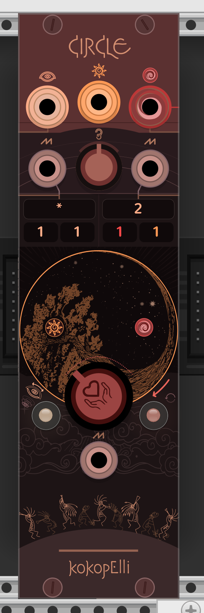

# Kokopelli Interfaces VCV Rack Modules

Includes module 'Circle' for VCV Rack.

Allows one to live create full songs. Pairs well with midi control, enabling very powerful live setups. Transform your song creation workflow to be based around using instruments, not clicking and clacking.

See youtube ['Michael Muszynski'](https://www.youtube.com/@michaelampm) for a tutorial/explanation. (If it's not there, I haven't made it yet, but now that I've got you on my page you should listen to my music of course.)

## Circle

## License

This software is dual-licensed:

1. **Non-Commercial Use**: Available under the MIT License for non-commercial purposes. See [LICENSE](./LICENSE).
2. **Commercial Use**: Requires a separate commercial license. See [COMMERCIAL_LICENSE](./COMMERCIAL_LICENSE) for details.

### Contact

To talk to me about music or music interfaces (I'm obsessed), or to inquire about a commercial license, please contact:

**Michael Muszynski**
- **Telegram**: @gwatcha (preferred)
- **Email**: michael.ampm@gmail.com

I also have a genius idea for a music live-creation physical device that would replace all music software hosts (e.g DAW, Vcv Rack) and most synthesizers (including modular). God is calling me to pursue other avenues of life so I can't work on transforming my sketches into approachable animations, and contacting or starting a company to create the device for people. If you're looking for a calling this would be a good one.
