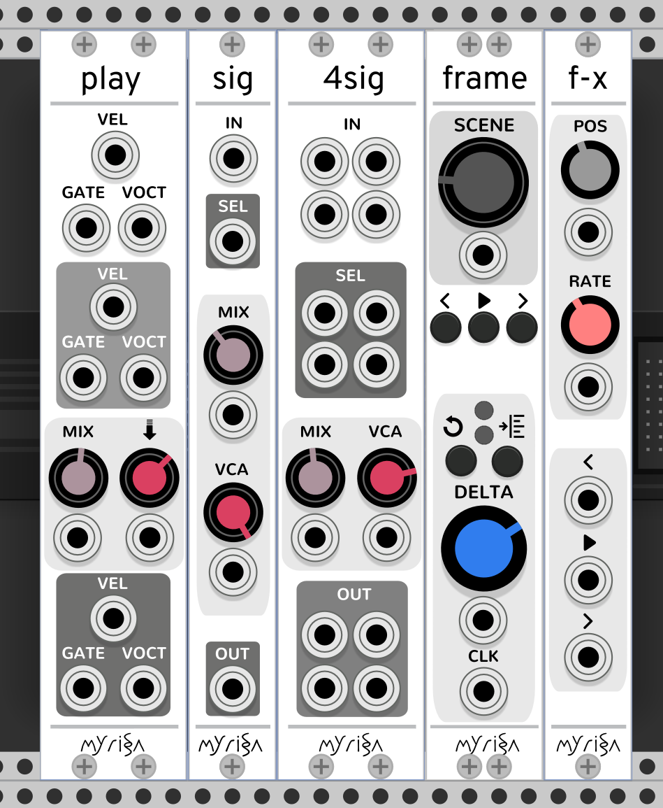

# Table of Contents

1.  [Myrisa Modules](#org2c43a77)
    1.  [Modules For Structure](#orge6e00c7)
        1.  [FRAME](#org01889cc)
        2.  [FRAME Expansion Modules](#org76d6e5b)
        3.  [TIMELINE](#org8965c74)
    2.  [Module for a Sound Interface](#org1758c98)
        1.  [MACRO](#org3002a8b)
        2.  [M-PARAM](#orgfdfb79b)
        3.  [M-OUT](#orgb514a1c)
        4.  [M-IN](#orgd22561d)
        5.  [INTERFACE](#org0c74d8a)

# Myrisa Modules

## Modules For Structure

These modules, provide the ability to record, loop, edit, playback, and sequence
signals. I designed the interface for fluidity and simple controls, making them
suitable for live recording where one can not pause to click and clack.

The signal captured may be audio, in which case, these modules act as a loop
recorder that can create multi-layered musical sections, and then sequence these
sections. If capturing control voltage one could use these to record 
and sequence parameter automation, or as a keyframer. 

### FRAME

The function of `FRAME` is to record and loop the input signals of the modules on
it's left. These modules - `PLAY`, `SIGNAL`, and `SIGNAL4`, - define the inputs and
outputs of `FRAME`. One can place multiple side by side to introduce more inputs
and outputs.

Despite the simple interface, one can use `FRAME` as a multi-track looper, a
sequencer for musical sections, a delay unit, a sample & hold unit, a sequencer,
and more! 

There is also a non input-output expander for `FRAME` called `FRAME-X`. This module
provides additional `RATE` and `POS` parameters, as well as additional control
ports.  It enables more creative ways to use `FRAME`.

`FRAME` supports [polyphonic](https://vcvrack.com/manual/Polyphony) input.

1.  Scene Selection

    A scene is simply a collection of looping buffers, or, in frame's terminology, a
    collection of 'layers'.
    
    The `SCENE` parameter adjusts which scene `FRAME` records and reads from.
    
    If `SCENE`'s position is between two scenes, the behaviour will depend on the
    "scene transition" option. 
    
    -   If set to  'smooth' it will output a weighted mix of both scenes, allowing for smooth crossfading between scenes.
    -   If set to 'discrete', the scene will snap to the nearest scene.
    -   If  set to 'sequence', the scene will snap to the nearest scene at the next
        clk step, and will also play the scene on transitioning.
    
    The port directly under `SCENE` modulates the parameter, allowing for
    interesting crossfade patterns, or voltage controlled scene sequencing.
    
    One may use multiple `SCENEs` to sequence musical sections or, in the case `FRAME`
    is capturing control voltage, a keyframer for control voltage.
    
    Scenes that have not recorded anything start with the layers of the scene
    before, so one may progress to the next scene to leave behind a 'checkpoint',
    that one may return to, or to just start developing a new scene by altering the
    current one.

2.  Recording with FRAME

    When `DELTA` has moved a small threshold away from 12 o'clock, `FRAME` will
    start recording. The scene that `FRAME` chooses for recording, is the scene that
    is closest to the sum of the `SCENE` parameter and `SCENE` port.
    
    If `FRAME` detects a clock signal on the `CLK` port, it will snap the  recording start
    and end points to mutiples of the clock period. 
    
    Recording behaviour depends on whether `FRAME` is in *global* mode, or *layer*
    mode. The `DELTA_MODE` button (up-right of `DELTA`) toggles between these modes.
    The lower LED in the delta section indicates its state.
    
    Recording behaviour also depends on the direction of `DELTA`'s rotation. If it
    moves clockwise, it activates the *extend* record mode. If `DELTA` moves
    counter-clockwise, it activates *add* mode. When `DELTA` returns to 12 o'clock,
    `FRAME` finishes recording. The upper LED in the delta section indicates the
    current recording mode.
    
    The record and delta modes create four recording behaviours when combined.
    
    1.  Recording Behaviours
    
        1.  *global* and *extend* mode
        
            `FRAME` records the input signal into a new buffer, and loops the buffer when
            `DELTA` returns to 12 o'clock.
            
            Used for dubbing a loop with elements that are longer than the current loop
            length - for example, adding a chord progression for a repeating phrase.
        
        2.  *global* and *add* mode
        
            `FRAME` records the input signal into a new buffer with the same length as the
            active buffer. On reaching the end, it repeats the process.
            
            Used for continuously recording multiple takes to audition and filter later
            on, or record new layers continuously.
        
        3.  *layer* and *extend* mode
        
            `FRAME` records the input signal into the active buffer, and upon reaching the
            end, will continue recording as well as extend the active buffer by looping
            the old contents.
            
            Used for creating variation at the xth repetition of a buffer.
        
        4.  *layer* and *add* mode
        
            `FRAME` records the input signal into the active buffer and when it reaches the
            loop end, it repeats the process.
            
            Used for continuously overdubbing a buffer.
    
    2.  Buffer Attenuation
    
        In all four mode combinations, if one twists further than the threshold
        position, it affects the amplitude of previous buffers at the current position,
        or in other words, the 'attenuation power' of the recording. If delta mode is
        *layer*, it only attenuates the active buffer, if delta mode is *global*, it
        attenuates all buffers.
        
        The attenuation power grows exponentially as `DELTA` twists, and when it reaches
        a maximum, it will erase previous buffers.
        
        This attenuation behaviour allows for easily 'pushing back' previous layers in a
        live-looping performance to create more movement, and also, to create
        attenuation envelopes or erase parts of previous layers.

3.  Button Behaviour

    Excluding the `DELTA_MODE` button, there are four other buttons on `FRAME`.
    
    The button to the upper left of `DELTA` is the `UNDO` button. `FRAME` keeps
    track of states before and after engaging record modes, and `UNDO` recalls the
    previous states. When one presses `UNDO` in a record mode, `FRAME` will discard
    any changes, and try again on the next loop start of the selected layer.
    
    The `LEFT` and `RIGHT` buttons change the active buffer, and the `PLAY` button
    resets all buffer positions to the beginning.

4.  FRAME Additional Uses Cases

    1.  Delay Unit
    
        `FRAME` can function as a delay unit in the case *add* mode is consistently on
        in *layer* mode. `DELTA` would control the feedback in this case.
        
        One may use `FRAME-X` to change the rate and offset of the delays to produce
        cool delay effects.

### FRAME Expansion Modules

1.  SIGNAL

    `SIGNAL` takes a polyphonic (or monophonic) signal as input, sends it to
    `FRAME`, and outputs a mix of the input signal and output from `FRAME`.
    
    It also outputs `FRAME`'s active/selected buffer. This is useful in the case of
    applying audio functions or (control voltage functions) to particular buffers in
    `FRAME`. To do this, one would select a buffer, route `BUF` into other VCV Rack
    modules, route the output of those modules back into the input, and modify the
    buffer by engaging recording in *layer* mode.
    
    1.  MIX
    
        -   At 7'oclock, `SIG` only outputs `FRAME` output, and the input signal is fully
            attenuated. This is useful to control the input power, but also in the case multiple expansion modules exist so to not record this input signal when `FRAME` enters a record mode.
        -   At 12'oclock, the input signal is not attenuated.
        -   At 2:30, the input signal is still not attenuated, and `SIG` outputs 100% of
            `FRAME`'s *active buffer*. Used for auditioning multiple takes that were loop
            recorded, and for using *layer* mode without sonic clutter from other layers.
        -   Past 2:30, `SIG` will attenuate the input signal until it is fully attenuated at  5'oclock (max cw).
    
    2.  VCA
    
        A VCA for the output. Used for setting or modulating the output volume.

2.  4SIGNAL

    `4IGNAL` is `SIGNAL`, just with 4 ports instead of 1. Its used for capturing
    multiple signals, as it saves space compared to 4 `SIGNAL` modules set side by
    side.

3.  PLAY

    `PLAY` takes 3 polyphonic (or monophonic) signals associated with MIDI recording
    as input.
    
    `PLAY` functions just like `SIG`, with a difference in how it attenuates signals.
    Attenuation only affects VEL (velocity) signals until max attenuation, where it
    also removes GATE signals and holds VOCT signals.

4.  FRAME-X

    This module is an expander for `FRAME`. When placed on its right side, it gives
    it extra `RATE`, and `POS` parameters, as well as ports for controlling `PREV`,
    `NEXT`, and `PLAY`.
    
    This module enables more ways to use `FRAME`, checkout the footnotes section if
    interested.
    
    The `POS` parameter controls the start offset of the buffers in the scene.
    
    The `RATE` parameter controls the speed at which `FRAME` plays back the buffers
    in the scene.
    
    All the button ports react to rising edges. The ports underneath `POS` and
    `RATE` modulate the parameters.
    
    1.  FRAME-X Usage Ideas
    
        1.  Pitch Shifter
        
            When one sets up `FRAME` as a delay unit with a small buffer size and adjusts
            the `RATE` of `FRAME-X`, it will seem like the pitch of the sound is higher or
            lower.
        
        2.  Advanced Sample & Hold / Sequencer
        
            When one sets `RATE` to 0, `FRAME` does not progress at all but still may record
            and read signals. In this case, it acts as an advanced sample and hold module.
            Adjusting the `SCENE` knob smoothly transitions between samples.
            
            One may sequence samples in interesting ways using the `SCENE` modulation port.
        
        3.  Advanced MIDI Looper
        
            When `FRAME` is expanding `PLAY`, one may create interesting playback patterns
            by recording some GATE, VOCT, and VEL signals, and varying or modulating the
            `RATE` and `POS` ports. One idea is to record a chord, and modulate `RATE` and
            `POS` with low frequency noise sources with channel variation to create
            fluctuating, dreamy note sequences.
        
        4.  MIDI Instrument
        
            MIDI keyboards output VOCT (pitch) and GATE signals.
            
            One may patch the `RATE` port with a VOCT signal, and the `PLAY` port with a
            GATE signal, patch the output VCA with a GATE controlled envelope, and play
            `FRAME` as if it were an instrument.
            
            This use case applies to all the additional use cases below.
        
        5.  Wonky Audio Playback Unit
        
            One may patch the `RATE` port to modulate the speed of playback and recording,
            and one may patch the `POS` port to modulate the offset of `FRAME` buffers.
            Using these, one could get some cool sounds with `FRAME` - especially if there
            is variation across channels. Have you ever wondered what playing back speech
            with a sin wave sounds like? I have.
        
        6.  Wavetable Oscillator with Additive and Subtractive Synthesis Capabilities
        
            `FRAME` can be a wavetable oscillator if either the `CLK` rate is high, or a
            high frequency saw wave is input into `POS`.
            
            In this use case, the `SCENE` parameter morphs between recorded waves, and the
            `DELTA` parameter would add or subract from a `SCENEs` wave.
        
        7.  Granular Synthesis Engine Component
        
            To use `FRAME` as a granulart synthesis engine component, one would record an
            audio signal, then patch a constant polyphonic signal with channel variation
            into `POS`.
            
            To create the grains, one would patch the `VCA` in `SIGNAL` with short, repeating
            envelopes with phase variation across channels.

### TIMELINE

TODO

## Module for a Sound Interface

These modules are for the [sound interface](https://github.com/gwatcha/sound-interface).

### MACRO

Defines a macro. A macro consists of one or multiple `M-PARAM`, and `M-IN` modules,
a strip of modules that follow it, and one or multiple `M-OUT` modules after the
strip, which touch the `MACRO` module.

User can enter a name for the macro, and save to file similar
to stoermelders `STRIP`. The user can also use it to load macro files. 

### M-PARAM

8 parameter mapping slots, with a place to enter an optional alias for the
parameter.

These mappings define the parameters of a macro.

Placed on the left side of a strip of modules.

### M-OUT

8 in ports, with place to enter names, as well as labels about type of signal

-   gates (blue), clks (purple), triggers (light blue), control (yellow), audio
    (red), voct (green)

These ports define the output of the macro. they can be routed via OSC to any
`M-IN` module, as well as recorded via a `FRAME` like interface.

Placed on the right side of a strip of modules.

### M-IN

8 out ports, with place to enter names, as well as labels about type of signal.

These ports define the inputs for a macro. The signal on them can come from any `M-OUT` module.

Placed on the left side of a strip of modules.

### INTERFACE

This  module is the brains of the Sound Interface. The user inputs an address
where it will listen for OSC messages from the controller. It will react to
these messages and do multiple tasks, such  as 

-   control the routings between `M-OUT` and `M-IN` modules. (control macro routing)
-   control the values of `M-PARAM` modules. (control macro parameters)
-   record and loop `M-OUT` module outputs ('frame' macros)
-   intelligently disable modules that have a recording downstream of
    the routing graph.
-   change active macros
-   control the timeline

